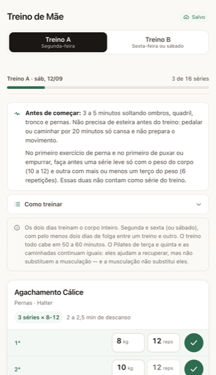
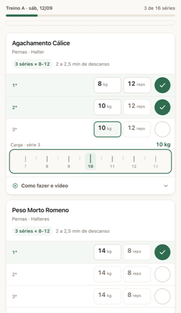
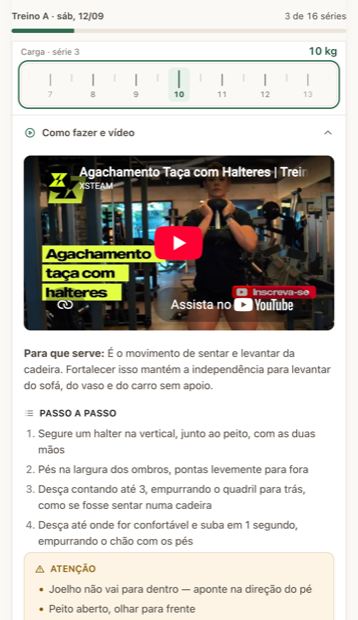

# Treino

Aplicativo web que minha mãe usa na academia: mostra o treino do dia, ensina a
execução de cada exercício e registra carga e repetições sem que ela precise
digitar nada.

Está no ar, rodando num container LXC no meu servidor Proxmox de casa, exposto
por Cloudflare Tunnel.

**Sem framework, sem build, sem dependência.** Frontend em ES modules puros;
backend em `node:http` + `node:sqlite`. O `package.json` do servidor não tem
bloco `dependencies`.

| | | |
|:-:|:-:|:-:|
|  |  |  |
| O treino do dia | Registrar sem teclado | Como fazer |

---

## O problema

Ela treina sozinha, duas vezes por semana, com uma ficha A/B prescrita pelo
professor. O papel amassa, a letra some e no meio da série ela não lembra qual
carga usou da última vez. Aplicativos de academia resolvem isso cobrando um
cadastro, uma assinatura e trinta toques de configuração.

Este resolve para uma pessoa só, e por isso pode ser melhor: a ficha dela já
está dentro, os textos de segurança foram escritos para o corpo dela, e a única
coisa que ela faz é marcar o que fez.

## As três decisões que importam

### 1. Registrar custa menos que lembrar

Carga e repetições não são campos de digitação. Cada valor é um botão que abre
uma **régua horizontal**: ela arrasta o dedo e o valor encaixa em cada traço,
com uma vibração curta a cada traço cruzado.

A régua abre já centrada no valor mais provável — o desta série, senão o da
série anterior, senão a carga da última vez, senão o alvo prescrito. Repetir a
carga da semana passada custa zero movimento: é só marcar a série como feita, e
o que está na tela é gravado. **Uma série inteira é um toque.**

A régua também responde a setas, `Home`/`End` e `PageUp`/`PageDown`, e se anuncia
como `role="slider"` com o valor atual. No iPhone a Vibration API não existe e a
régua funciona igual, só sem o retorno tátil.

### 2. O aparelho é a fonte da verdade; o servidor é backup

O wifi da academia cai. Um app que trava esperando resposta de rede é um app que
ela desiste de usar.

Toda gravação vai primeiro para o `localStorage` — instantânea, offline — e entra
numa fila enviada ao servidor quando há rede. Nenhuma outra parte do código toca
em `localStorage` ou em `fetch`: isso vive todo em `public/js/storage.js`.

Conflitos são resolvidos por **carimbo de tempo do cliente, com a mesma regra nos
dois lados**. O servidor não confia cegamente no carimbo: relógio de celular
adiantado congelaria o registro para sempre, então o carimbo é limitado a `agora`
na validação.

### 3. Conteúdo é autorado, não configurado

Exercícios e fichas são **JSON versionado no git**. Não existe banco de conteúdo,
não existe tela de admin, e não vai existir.

```
public/data/exercicios.json        catálogo reutilizável: instruções, segurança,
                                   músculos, id do vídeo no YouTube
public/data/fichas/*.json          prescrição: séries, reps, descanso, aquecimento
```

A ficha referencia o catálogo por id. Ficha nova é um arquivo novo, um commit e um
`git pull` no servidor. A ficha antiga fica no repositório para que o histórico
dela continue interpretável.

Séries, repetições, descanso e aquecimento não são chute: vieram de
[`docs/pesquisa-treino.md`](docs/pesquisa-treino.md), um levantamento sobre
treino de força para mulheres na pós-menopausa.

## Outras decisões

**Sessão implícita.** Não existe botão "iniciar treino". A sessão do dia é criada
sozinha na primeira série marcada — a presença se registra como efeito colateral
de treinar.

**O link é a senha.** Cada pessoa tem um link com token (`/?k=...`) que ela salva
na tela de início do celular. O token sai da barra de endereço assim que é
guardado. Sem tela de login, sem senha para ela esquecer.

**Vídeos carregam sob demanda.** Os `iframe` do YouTube só são criados quando ela
abre o exercício. Doze iframes simultâneos travariam o celular e queimariam o
plano de dados dela.

**Tudo que vem do cliente é validado** em `server/src/validacao.js`: formato de
data, ids, faixa do índice, teto de 500 registros por envio, carga e reps como
texto numérico com limite de casas.

## Estrutura

```
public/                       frontend estático — nenhum build
  index.html
  css/style.css
  js/app.js                   renderização e interação
  js/storage.js               local-first: localStorage + fila de sync
  js/regua.js                 seletor de carga/reps por arrasto
  js/tato.js                  retorno tátil da régua
  js/icones.js                ícones SVG autorais
  data/                       conteúdo versionado (catálogo + fichas)

server/
  src/server.js               4 rotas em node:http
  src/db.js                   SQLite embutido (node:sqlite) + schema
  src/validacao.js            validação da entrada da API
  src/http.js                 helpers: JSON, estáticos, token
  scripts/criar-usuario.js    cria usuário e imprime o link de acesso
  scripts/backup.js           backup consistente + rotação de 30 dias
  test/api.test.js            22 testes

deploy/                       nginx, systemd, cloudflared, backup
docs/                         produto, design e a pesquisa por trás da ficha
```

O banco tem três tabelas: `usuarios`, `sessoes` (uma por dia de treino, única por
`user_id + data + treino_id`) e `series` (única por `sessao_id + exercicio_id +
indice`) — as chaves únicas são o que torna o envio da fila idempotente.

## API

| Método | Rota | O que faz |
|--------|------|-----------|
| `GET`  | `/api/saude`   | healthcheck, sem token |
| `GET`  | `/api/eu`      | nome e ficha ativa do usuário |
| `GET`  | `/api/sessoes` | histórico (`?desde=AAAA-MM-DD` filtra) |
| `POST` | `/api/series`  | grava séries em lote — é o que a fila offline envia |

Token em `Authorization: Bearer <token>` ou `?k=<token>`.
Os dados são isolados por `user_id` no banco, e há teste para isso.

## Rodar localmente

Precisa de **Node 22.5+** (pelo `node:sqlite`). Não existe `npm install`.

```sh
node server/scripts/criar-usuario.js "Mãe" ficha-mae-2026-01 http://localhost:3000
node server/src/server.js
```

Abrir o link com `?k=...` que o primeiro comando imprimiu.

```sh
cd server && npm test    # 22 testes da API
```

## Em produção

```
celular → borda da Cloudflare · TLS · treinomae.arthuradriano.com
              ↕ túnel de saída — nenhuma porta aberta no roteador
Proxmox (onboot)
└── LXC Debian 13, sem privilégio, 1 vCPU / 512 MB / 8 GB
    ├── cloudflared  → 127.0.0.1:80
    ├── nginx        → estático + /api/ → :3000
    └── treino       → node src/server.js @ 127.0.0.1:3000
```

Nada dentro do container escuta num endereço roteável — o `sshd` é desligado na
instalação e a administração é toda por `pct exec` a partir do host. O túnel de
saída dispensa porta aberta, IP fixo e renovação de certificado; em troca, o token
passa pela borda da Cloudflare e aparece no log de requisições deles.

Depois de queda de energia volta sozinho: `onboot=1` no container, `Restart=always`
nos três serviços, e o cloudflared disca para fora. Nenhum passo manual.

Backup em três camadas: dump diário do SQLite dentro do container (30 dias de
rotação), `vzdump` do LXC no Proxmox, e uma cópia fora da máquina.

Passo a passo completo em **[deploy/DEPLOY.md](deploy/DEPLOY.md)**.

## Documentação

- [deploy/DEPLOY.md](deploy/DEPLOY.md) — instalar, operar, atualizar, restaurar backup
- [docs/PRODUCT.md](docs/PRODUCT.md) — usuária, contexto de uso e princípios do produto
- [docs/DESIGN.md](docs/DESIGN.md) — sistema de design: cores, tipografia, componentes
- [docs/pesquisa-treino.md](docs/pesquisa-treino.md) — a pesquisa por trás da ficha

## Licença

[MIT](LICENSE).
